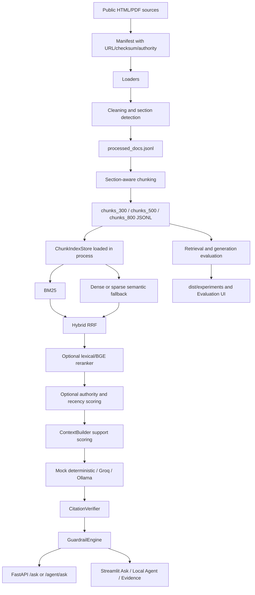

# VietRAGOps — Master Context Card for SOL Redesign

> Prepared by an Analyze-Team read-only review on 2026-08-17.
> This document is a design handoff, not an implementation authorization.
> It describes the repository as inspected and deliberately separates verified facts,
> historical claims, and inference.

## 0. How to use this card

Give this entire file to SOL before asking for a redesign. SOL should treat the
repository itself as the final source of truth for implementation details, and
this card as the compressed map of what matters.

The important starting conclusion is:

> VietRAGOps is not an empty or failed prototype. It is a fairly complete,
> offline-first Vietnamese academic-policy RAG demo and evaluation workbench.
> Its largest product gap is not another retriever or another UI screen. It is
> the missing document lifecycle: upload -> validate -> provenance/version ->
> parse -> clean -> chunk -> index -> review -> publish/retire.

Do not interpret “Phase 11 done” as “production ready”. The phase tracker means
the planned demo/documentation sequence completed. Current evidence still leaves
Docker image execution, live provider behavior, current pytest execution, browser
interaction, authentication, safe upload/indexing, source freshness, and human
answer-quality evaluation unresolved or unverified.

### Evidence labels used in this card

- **Verified-current**: observed directly in this review on 2026-08-17.
- **Repo fact**: directly supported by source files, tracked artifacts, or Git.
- **Historical**: stated by an older report/log; not re-proven in this review.
- **Inference**: reasoned interpretation of the code/product, not an explicit
  requirement from the owner.
- **Open question**: must be answered before a material design decision.

No `.env` value was read, copied, or included. Only the existence and safe
placeholder surfaces were inspected.

---

## 1. Repository identity and scope

### Actual paths

The user-visible workspace contains two separate Git repositories plus a
non-repository parent directory:

```text
D:\Project cua Dat\VietRAGOps\vietragops_ai_workspace_pack\
├─ VietRagOps\                 # actual application repo; redesign target
└─ ai-agent-workspace-pack\    # agent workflow/templates; not app runtime
```

The `analyze-team/SKILL.md` used for this review is:

```text
D:\Project cua Dat\VietRAGOps\vietragops_ai_workspace_pack\ai-agent-workspace-pack\analyze-team\SKILL.md
```

The parent directory is not itself the application Git root. Commands for the
application must normally run from:

```text
D:\Project cua Dat\VietRAGOps\vietragops_ai_workspace_pack\VietRagOps
```

This root-vs-child layout is itself an operational risk. The parent also has
duplicated-looking root files (`README.md`, `Dockerfile`, `docker-compose.yml`,
`requirements.txt`, etc.). Before redesign or deployment, choose one canonical
application root and make all packaging commands unambiguous.

### Git snapshot

**Verified-current:**

- Application repo: `VietRagOps`.
- Branch: `main`, tracking `origin/main`.
- Working tree: clean at review time.
- HEAD: `5b9045d2c53844ef9744074539ff342854469ed0` (`5b9045d`).
- HEAD subject: `chore: polish Docker context and Vietnamese matching text`.
- HEAD timestamp: `2026-06-04T22:45:46+07:00`.
- `ai-agent-workspace-pack` is a separate Git repo at `510c4ba` and is only the
  process/template layer for this task.

**Do not claim** that the current application is at the latest upstream state
without re-checking Git/remotes after this handoff.

---

## 2. Product summary

### Current product promise

VietRAGOps answers Vietnamese questions over public university academic/policy
documents, returns retrieved evidence and citations, refuses unsupported or
private questions, and exposes enough retrieval/evaluation detail to inspect the
pipeline.

Primary source: `VietRagOps/ALWAYS_READ/01_PROJECT_CONTEXT.md:5-34`.
Product-facing source: `VietRagOps/README.md:3-24`.

### What it is today

**Verified-current/repo fact:** the strongest description is:

> A local/offline-first RAG demo and evaluation workbench for TDTU-style public
> academic-policy documents, with FastAPI, Streamlit, deterministic fallback,
> optional Groq/Ollama, citation verification, refusal guardrails, and benchmark
> artifacts.

The engineering showcase layer is more complete than the real student-service
layer. There is no evidence of user accounts, personalized student records,
conversation history, notification, workflow integration, or private academic
data access.

### Likely product layers

These are useful design hypotheses, not confirmed owner requirements:

1. **Portfolio/recruiter layer:** demonstrate RAG engineering, evidence,
   guardrails, evaluation, local models, and reproducibility.
2. **Public academic-policy assistant:** help students or visitors search public
   regulations, curriculum, credits, email instructions, and procedural guides.
3. **Maintainer/research workbench:** curate sources, rebuild indexes, inspect
   failures, compare retrievers, and review stale/conflicting documents.

The current repository supports all three partially, but has no explicit product
decision about which one wins.

---

## 3. Current corpus and data facts

**Verified-current from manifest and JSONL artifacts:**

- 37 source documents.
- 32 HTML and 5 PDF.
- 31 marked `official`; 6 marked `faculty`.
- 11 domain labels: academic policy, academic schedule, admission,
  course registration, curriculum, email usage, graduation requirement,
  regulation, student account, student guide, training regulation.
- 37/37 processed rows have `parse_status=ok` in
  `data/processed/processed_docs.jsonl`.
- 481 extracted sections.
- Runtime default is `data/chunks/chunks_500.jsonl` with 695 chunks.
- Alternative artifacts are 1,036 chunks (`chunks_300.jsonl`) and 572 chunks
  (`chunks_800.jsonl`).
- Current chunk validation passed for all three files:
  - `chunks_300`: duplicate rate `0.0010`, abnormal `0`.
  - `chunks_500`: duplicate rate `0.0014`, abnormal `0`.
  - `chunks_800`: duplicate rate `0.0017`, abnormal `0`.
- The current corpus includes admission handbooks, curriculum pages, training
  regulations, student portal/guidance pages, registration/timetable guidance,
  graduation conditions, and student email instructions.

**Historical/reported facts that need refresh before external claims:**

- The handoff reports say 30 documents are active and 7 outdated.
- The handoff reports say 28/37 documents lack reliable `published_at`.
- The source collection has checksums and source URLs, but freshness and legal /
  ownership governance are not implemented as a user-facing lifecycle.

Primary sources:

- `VietRagOps/data/manifests/documents_manifest.csv`
- `VietRagOps/data/processed/processed_docs.jsonl`
- `VietRagOps/data/chunks/*.jsonl`
- `VietRagOps/reports/data_collection_summary.md`
- `VietRagOps/reports/technical_report.md:20-55`
- `VietRagOps/scripts/collect_phase1_docs.py:22-40,119-211`

### Corpus quality implications

- The corpus is small enough that a modular monolith and local file-backed index
  are adequate for the next MVP.
- It is large and heterogeneous enough that source version, effective date,
  document authority, conflict handling, table fidelity, and document review are
  product-critical.
- A crawl timestamp must not be treated as the same thing as legal/effective
  freshness. Current `recency_score` can fall back to crawled year or infer a
  year from identifiers/text (`rag/retrieval/source_priority.py:37-89`).

---

## 4. Existing repository map

```text
VietRagOps/
├─ app/                         FastAPI app, routes, schemas, configuration
│  ├─ main.py                   app assembly and router registration
│  ├─ api/                      health, documents, retrieval, ask, agent, eval
│  ├─ core/                     settings, cached store/generator, errors/logging
│  └─ schemas/                  Pydantic request/response contracts
├─ rag/
│  ├─ loaders/                  HTML, PDF, DOCX, Markdown/text loaders
│  ├─ preprocessing/            normalize, boilerplate removal, section detector
│  ├─ chunking/                 section-aware chunking and metadata/checksum
│  ├─ retrieval/                BM25, dense, hybrid, reranker, authority/recency
│  └─ generation/               context, prompt, providers, answer, guardrails,
│                              citation verification
├─ evals/
│  ├─ datasets/                 golden/dev/validation/test JSONL
│  ├─ metrics/                  retrieval, generation, abstention, system metrics
│  └─ experiments/              single-run and matrix runners/report export
├─ frontend/                    Streamlit UI and components
├─ scripts/                     collection, processing, chunking, validation,
│                              dataset building, Ollama checks
├─ data/                        raw docs, manifest, processed docs, chunks
├─ dist/                        ignored/generated experiment artifacts
├─ tests/                       unit, API, retrieval, generation, eval tests
├─ reports/                     phase reports, benchmarks, failure analysis,
│                              technical report, final handoff
├─ project_context_cards/       phase 0-11 planning/quality cards
├─ ALWAYS_READ/                 mandatory agent context and implementation log
├─ assets/                      architecture.md and architecture.mmd
├─ requirements.txt             unpinned lower-bound dependencies
├─ Dockerfile / docker-compose  packaging; Qdrant and optional Postgres surfaces
└─ .github/workflows/ci.yml    compile, pytest, chunks, retrieval smoke, compose
```

**Repo fact:** `ai-agent-workspace-pack/` is not imported by the application at
runtime. It contains the Analyze Team, Advisor Team, handoff, prompting,
testing, and repository-hygiene instructions used to operate AI sessions.

---

## 5. Architecture and runtime flow



### Pipeline details

1. `scripts/collect_phase1_docs.py` downloads a curated source catalog, writes
   raw files, and records URL, source type, domain, authority, language, dates,
   path, checksum, status, and notes.
2. `scripts/run_phase2_processing.py` chooses an HTML/PDF/DOCX/Markdown loader,
   extracts blocks, cleans text, detects headings, and writes processed JSONL.
3. `scripts/chunk_documents.py` creates section-aware chunks with configurable
   sizes 300/500/800, overlap, heading path, page data, token estimate, char
   offsets, SHA-256 chunk checksum, and chunk config.
4. `ChunkIndexStore.from_jsonl` loads the chosen JSONL into memory. It is cached
   by `app/core/config.py:get_store()` (`app/core/config.py:34-36`).
5. BM25 and dense retrieval run over the in-memory store. Dense tries a local
   SentenceTransformer model and silently falls back to a deterministic sparse
   semantic backend if unavailable (`rag/retrieval/dense_retriever.py:106-120`).
6. Hybrid retrieval fuses BM25 and dense ranks with RRF
   (`rag/retrieval/hybrid_retriever.py:20-64`).
7. Advanced hybrid can apply lexical/BGE reranking plus authority and recency
   weights (`rag/retrieval/advanced_hybrid_retriever.py:24-125`).
8. `ContextBuilder` expands candidates, adds global lexical candidates, computes
   term/bigram/quality/hybrid support, and selects top-k context
   (`rag/generation/context_builder.py:21-108`).
9. `AnswerGenerator` either calls a provider or creates deterministic extracted
   Vietnamese evidence. It then verifies citations and may retry/refuse/fallback
   (`rag/generation/answer_generator.py:60-177`).
10. `CitationVerifier` requires the cited chunk to be retrieved and the quoted
    evidence to occur in that chunk (`rag/generation/citation_verifier.py:17-43`).
11. `GuardrailEngine` refuses private-data patterns, low support, low lexical or
    low bigram evidence, and repeated citation failure
    (`rag/generation/guardrails.py:29-64`).

### Important architecture truth

Qdrant is present as an optional helper and is started by Compose, but the default
runtime path is not Qdrant-backed. The app loads a JSONL into `ChunkIndexStore`
and uses local BM25/dense/sparse retrieval. Postgres is an optional Compose
profile with no application schema/repository usage. Do not redesign around these
services merely because they appear in `requirements.txt` or Compose.

Evidence:

- `VietRagOps/app/core/config.py:12-60`
- `VietRagOps/rag/retrieval/qdrant_indexer.py:1-74`
- `VietRagOps/docker-compose.yml:1-58`

---

## 6. API and UI contracts

### API routes

| Route | Current behavior | Main source |
|---|---|---|
| `GET /health` | Returns status, provider/model, Groq availability, Ollama status | `app/api/routes_health.py:11-21` |
| `POST /retrieve` | Selects BM25/dense/hybrid/advanced hybrid and returns ranked chunks/debug | `app/api/routes_retrieval.py:15-65` |
| `POST /ask` | Grounded answer; guardrails cannot be disabled through API | `app/api/routes_query.py:16-39` |
| `POST /agent/ask` | Optional Ollama tool-call demo, candidate query heuristics, grounded fallback, tool trace | `app/api/routes_agent.py:15-23,230-339` |
| `GET /documents` | Lists manifest rows with chunk counts from the static store | `app/api/routes_documents.py:41-58` |
| `GET /documents/{doc_id}` | Returns manifest metadata and chunk count | `app/api/routes_documents.py:61-82` |
| `POST /documents/upload` | Writes uploaded bytes under `data/raw/uploads` | `app/api/routes_documents.py:22-31` |
| `POST /documents/index` | Counts currently loaded chunks; does not index uploaded files | `app/api/routes_documents.py:34-38` |
| `POST /eval/retrieval` | Runs a retrieval eval from caller-provided paths | `app/api/routes_eval.py:17-20` |
| `POST /eval/generation` | Runs a generation eval from caller-provided paths/config | `app/api/routes_eval.py:23-36` |
| `GET /experiments` | Lists JSON artifacts under a relative `dist/experiments` path | `app/api/routes_eval.py:39-50` |
| `GET /experiments/{id}` | Reads a matching experiment JSON from a relative path | `app/api/routes_eval.py:53-57` |

### Request/response shape

`app/schemas/query.py` defines:

- Retrieval request: question, top_k 1-20, retriever, use_reranker, debug alias.
- Ask request: question, top_k 1-20, debug alias, use_reranker, guardrail flag.
- Ask response: answer, citations, confidence, refusal, refusal reason, debug.
- Agent response: answer, provider/model/status, generation mode, tool calls,
  latency, fallback flags, verified flag, citations, retrieved chunks.
- Citation: doc_id, chunk_id, source URL, heading path, quoted evidence.

Source: `VietRagOps/app/schemas/query.py:6-92`.

### UI

The Streamlit app exposes five current tabs:

- Ask.
- Local Agent.
- Evidence.
- Evaluation.
- Documents.

Source: `VietRagOps/frontend/streamlit_app.py:665-735` and subsequent tab blocks.

It can probe a live API and fall back to the local pipeline/artifacts when the API
is unavailable (`frontend/streamlit_app.py:551-633`). This is excellent for a
demo, but broad `except Exception: pass` fallback can hide real operational bugs
from maintainers.

---

## 7. Current providers and answer behavior

### Provider modes

Configured by `LLM_PROVIDER` with default `mock`:

- `mock`: deterministic local answer path; no external provider required.
- `groq`: optional HTTP call using `GROQ_API_KEY` and `GROQ_MODEL`.
- `ollama`: optional local HTTP call using base URL/model/context settings.

Sources:

- `app/core/config.py:15-26,44-79`
- `rag/generation/provider_router.py:23-187`
- `rag/generation/groq_client.py:11-41`
- `rag/generation/ollama_client.py:26-111`
- `.env.example`

### Deterministic fallback

The fallback is deliberately conservative and citation-bound. It extracts
segments that overlap query tokens, prioritizes a few high-value terms, refuses
numeric/fee questions when evidence lacks a concrete figure, and has special
heuristics for some TDTU examples such as student email and “Khoa học máy tính —
136 tín chỉ”.

This is useful for reproducible demo behavior but is also an important redesign
warning: the answerer is partly a domain-specific demo script, not a general
answer synthesis engine. See `rag/generation/answer_generator.py:179-469`.

Do not delete these heuristics before replacing them with equivalent tests and
evidence behavior. Do not preserve them as the long-term product abstraction
without deciding whether the target is TDTU-specific.

---

## 8. Evaluation and metrics

### Datasets

The repository includes:

- `golden_qa.jsonl`: 120 rows (historical/report claim; verify before publishing).
- `dev_qa.jsonl`: 20 rows.
- `validation_qa.jsonl`: 6 rows.
- `test_qa.jsonl`: 20 rows.

The small validation split was chosen to keep a 216-config deterministic matrix
within local runtime limits. It is not a strong estimate of real-world answer
quality.

### Metrics implemented

- Retrieval: Recall@k, Precision@k, MRR, nDCG where available.
- Generation: exact match, token F1, citation support, answer correctness.
- Abstention: refusal accuracy, unsupported answer rate.
- System: latency p50/p95, error rate.
- Failure labels: retrieval miss, stale source, citation mismatch, hallucination,
  ambiguous query.

Sources:

- `evals/metrics/`
- `evals/experiments/run_generation_eval.py:75-151`
- `VietRagOps/reports/benchmark_report.md`
- `VietRagOps/reports/failure_analysis.md`

### Historical benchmark snapshot, not current production truth

The committed reports describe a deterministic/mock benchmark:

- Runtime-friendly single run: hybrid + chunks_500 + top_k 5 + guardrails on.
- Recall@5: `0.7500` on the small generation validation split.
- Token F1: `0.2047`.
- Citation support: `1.0000`.
- Refusal accuracy: `1.0000`.
- The full matrix's reported best configuration was BM25 + top_k 3 + guardrails
  off, with Token F1 `0.2807` and Recall@5 `0.7500`.
- The report explicitly says the matrix result is not a final LLM-quality
  benchmark.
- Failure report counts `retrieval_miss=222` and `stale_source=84` in the
  deterministic matrix, but these are not production error rates.

Sources:

- `reports/benchmark_report.md:3-65`
- `reports/failure_analysis.md:3-33`
- `reports/FINAL_PROJECT_HANDOFF.md:85-114`

### Current verification status

**Verified-current on 2026-08-17:**

- Chunk validation passed for all three chunk artifacts.
- `docker compose config` parsed successfully, but emitted a local Docker config
  access warning and reflected the host's current provider environment. Repeat it
  with explicit safe mock variables before relying on the output.
- Current working tree remains clean after these checks.

**Blocked/unverified-current:**

- `pytest -q` could not run because the available Python environments in this
  session do not have `pytest` installed. The historical `52 passed` claim remains
  historical, not a current test proof.
- Docker daemon/image build/container smoke was not run successfully in this
  review.
- Real Groq and Ollama calls were not run.
- Interactive browser/UI behavior was not run.

Recommended safe baseline command sequence from the app repo:

```powershell
Set-Location 'D:\Project cua Dat\VietRAGOps\vietragops_ai_workspace_pack\VietRagOps'
$env:LLM_PROVIDER = 'mock'
$env:GROQ_API_KEY = ''
$env:VIETRAGOPS_DOCKER_GROQ_API_KEY = ''
$env:PYTHON_DOTENV_DISABLED = '1'
python -m compileall app rag evals frontend scripts tests
pytest -q
python scripts/validate_chunks.py --chunks-dir data/chunks
python -m evals.experiments.run_retrieval_eval --chunks data/chunks/chunks_500.jsonl --qa evals/datasets/dev_qa.jsonl --retriever hybrid --top_k 5
python -m evals.experiments.run_generation_eval --chunks data/chunks/chunks_500.jsonl --qa data/../evals/datasets/validation_qa.jsonl --retriever hybrid --top_k 5 --guardrails
docker compose config
```

The `pytest` line is expected to remain blocked until dependencies are installed
in the chosen environment. Do not “fix” that by silently changing the project
dependency policy; choose a reproducible environment/lock strategy first.

---

## 9. Main unresolved gaps and risks

### P0 — Document ingestion is only a placeholder

`POST /documents/upload` writes `data/raw/uploads/<file.filename>` and returns
filenames. It does not normalize the filename, validate file type/size, protect
against path traversal, deduplicate, update the manifest, parse, clean, chunk, or
publish a new index.

`POST /documents/index` only counts the already-loaded static store. It does not
run the pipeline or refresh the cached `ChunkIndexStore`.

Evidence: `app/api/routes_documents.py:22-39`, `app/core/config.py:34-41`.

**Design consequence:** either implement this lifecycle properly or remove/hide
these endpoints from the user-facing product until they are real.

### P0 — No authentication or authorization found

There is no visible auth middleware, token, role, or permission layer in the
application routes. This is acceptable for a local demo but not for public upload,
evaluation path input, debug output, or provider-status exposure.

### P0 — Upload path and resource safety

Direct use of `settings.raw_upload_dir / file.filename` has no visible basename
normalization, allowlist, size limit, content sniffing, duplicate policy, or
malware scanning. Any redesign that exposes upload must fix this before UI polish.

### P1 — Static store and process cache

The app starts with a JSONL store cached by `lru_cache`. A new file cannot become
queryable without a defined rebuild and atomic swap strategy; in-process state is
not a durable index lifecycle.

### P1 — Qdrant/Postgres are packaging surfaces, not integrated architecture

Qdrant helper code exists, and Compose starts Qdrant. The default query path does
not call it. Postgres is optional Compose only; no schema or repository is wired.
Adding both services now would increase operational cost without fixing the
current correctness bottleneck.

### P1 — Relative-path behavior

`app/core/config.py` correctly derives `ROOT`, but `routes_eval.py` uses
`Path("dist") / "experiments"` and caller-provided paths. Running the API from a
different current working directory can produce missing artifacts or unsafe path
access. Normalize all application paths against a configured root and constrain
external paths.

### P1 — Source freshness and conflict handling

Authority and recency are heuristic scores. The system does not expose a formal
“effective from / effective until / supersedes / superseded by / conflict” model,
nor a human resolution workflow. A citation can prove where text came from without
proving that the cited text is currently legally or operationally valid.

### P1 — Evaluation validity

Citation support is not answer correctness. Refusal accuracy on six validation
items is not a production safety estimate. The QA set needs human-curated,
versioned, source-anchored examples for regulation conflicts, numeric/fee queries,
procedural queries, and unanswerable/private cases.

### P2 — Domain-specific heuristics

Hard-coded email/curriculum/136-credit rules improve a showcase but may overfit the
demo questions. Replace them gradually with general query classification,
metadata/evidence rules, and regression tests if the product is intended to grow.

### P2 — Operational reproducibility

Dependencies use lower bounds and there is no visible lock file. The current
session could not run pytest because the available Python environments lacked it.
Docker/live provider/browser checks were not current proof. Establish a single
supported Python version and lock/installation path before redesign claims.

### P2 — Silent frontend fallback

The Streamlit frontend catches broad exceptions and silently switches to local
mode. Keep a friendly fallback, but show the failure reason and mode clearly to
maintainers; otherwise API regressions look like successful demos.

---

## 10. Design options for SOL to compare

| Option | Shape | Benefit | Cost / risk | Time horizon | Tests needed |
|---|---|---|---|---|---|
| A. Hardened modular monolith | Keep FastAPI + Streamlit + file/SQLite metadata; make ingestion, versioning, auth, index rebuild, provenance real | Lowest rework; fits 37 docs/695 chunks; easy local demo and debugging | Limited scale; must keep boundaries disciplined | 2–6 weeks for a serious MVP | Upload security, pipeline integration, atomic index refresh, API contracts, source conflict, regression eval |
| B. RAGOps pipeline platform | API + async worker/job queue + Postgres metadata + Qdrant/vector service + object storage | Durable ingestion jobs, versioning, audit, scale, better operations | Significant infra and failure modes before product fit; current Qdrant/Postgres are not wired | 8–16+ weeks | Job retries/idempotency, index versioning, health/readiness, persistence, migration, load tests |
| C. Student-facing assistant product | Authenticated portal, search/answer UX, conversation/history, feedback, personalized academic context, notifications | Highest direct user value | Privacy, ownership, correctness, institutional integration, support burden | 8–20+ weeks | UX/browser tests, auth/ACL, privacy, conflict/freshness, human answer review, abuse/rate limits |
| D. Research/evaluation workbench | Make eval/retrieval/source review the primary product, with answer demo as one view | Strongest fit to existing engineering; useful for portfolio/research | Less obvious end-user product; can remain a showcase | 2–5 weeks | Reproducible runs, dataset provenance, metric validity, failure triage, artifact browsing |

### Recommendation

**Recommend A as the implementation foundation, with D as the near-term product
surface and a carefully bounded C-like user view later.** In plain language:

1. Keep the current retrieval, citation, refusal, and evaluation core.
2. Redesign the product around a trustworthy public-policy assistant plus a clear
   maintainer/evaluation workbench.
3. First make sources and indexing real and governed.
4. Do not add distributed infrastructure until document volume, update frequency,
   concurrency, or multi-tenant requirements justify it.

This recommendation changes to B if there are thousands of documents, frequent
automated updates, concurrent indexing jobs, multiple institutions, or a required
durable audit trail. It changes to C if the owner explicitly wants real student
usage and can answer auth/privacy/data-owner questions. It changes to D-only if
the main goal is portfolio/research evidence rather than a deployable service.

---

## 11. Recommended redesign thesis

### Working product name

**VietRAGOps — Trusted Vietnamese Academic Policy Assistant**

### Core promise

> Ask a question about public academic policy. Receive a concise answer only when
> the system can show the exact supporting evidence, the source authority and
> freshness context, and an honest refusal or conflict warning when the corpus is
> insufficient or contradictory.

### Two deliberate surfaces

#### Surface 1 — Public/user assistant

- Ask in Vietnamese.
- Answer summary first.
- Evidence cards below each claim.
- Source title, owner/domain, URL, effective/fetched date, version status.
- “I found conflicting sources” state instead of silently choosing.
- Clear refusal reason and suggested next action.
- Feedback: useful / incorrect / outdated / missing source.

#### Surface 2 — Maintainer/evaluation workbench

- Source inventory and freshness.
- Upload/validate/review/publish/retire workflow.
- Parse warnings and extraction quality.
- Index version and rollback.
- Retrieval evidence inspection.
- QA dataset and evaluation-run provenance.
- Failure queues for retrieval miss, stale source, conflict, numeric query,
  citation mismatch, and unsupported answer.

This makes the existing engineering strengths visible without pretending the
current static demo is already a production knowledge system.

---

## 12. Suggested development roadmap

### Stage 0 — Product decision gate

Deliver:

- one-page product brief;
- target persona and top 10 real user questions;
- source ownership and freshness policy;
- local demo vs hosted product decision;
- privacy/provider policy;
- success metrics and non-goals.

Acceptance:

- Everyone can state who the first user is, which corpus is in scope, and what an
  acceptable answer/refusal/conflict looks like.

### Stage 1 — Baseline and contract stabilization

Do first:

- install dependencies in a known environment and run the full test suite;
- freeze a baseline artifact with commit, data checksums, config, and commands;
- centralize all paths under `Settings.ROOT`;
- separate `retrieval`, `evidence`, `answer`, `source`, and `evaluation-run`
  contracts;
- fix experiment route path handling and caller path restrictions;
- make frontend mode/fallback errors observable.

Acceptance:

- API, CLI, UI, and tests use the same canonical repo root and artifact paths;
- a fresh clone can run deterministic retrieval/answer checks with documented
  dependencies;
- no current-vs-historical metric ambiguity remains in the README.

### Stage 2 — Real document lifecycle

Implement as a bounded modular-monolith workflow:

```text
upload/import
  -> size/type/security validation
  -> checksum/deduplication
  -> source metadata and provenance
  -> parse + warnings
  -> section/chunk build
  -> candidate index version
  -> human/source review
  -> atomic publish
  -> old-version retire/rollback
```

Minimum fields to add or formalize:

- source_id and stable document_id;
- source URL and retrieval timestamp;
- content checksum;
- publisher/authority;
- language;
- published/effective/expiry dates;
- supersedes/superseded_by;
- parse status and warnings;
- index version;
- review state and reviewer note.

Acceptance:

- An uploaded document can be validated, processed, indexed, queried, and
  removed/retired without restarting the API or mutating the live index halfway.
- Repeating the same upload is idempotent by checksum.
- Unsafe filenames, types, sizes, and paths are rejected.
- Every answer can identify the published source/index version used.

### Stage 3 — Trust and source governance

- Add explicit effective-date/source-conflict logic.
- Treat `citation_verified` and `answer_correct` as different fields.
- Return an evidence-to-claim mapping rather than only whole-chunk quotes.
- Add “source conflict” and “outdated source” refusal/warning states.
- Define what confidence means; do not call a heuristic support score model
  probability.

Acceptance:

- Conflict fixtures produce a visible conflict state and deterministic policy.
- A stale source cannot silently outrank a current authoritative source.
- Human reviewers can inspect and correct the source decision.

### Stage 4 — Evaluation upgrade

- Expand the 6-row validation split.
- Make datasets source/version anchored and human-curated.
- Keep deterministic/mock, local-model, and cloud-model lanes separate.
- Add human labels for answer correctness, citation entailment, freshness, and
  refusal appropriateness.
- Track regression thresholds per question category, not only aggregate averages.

Acceptance:

- A release report says exactly which lane ran, with which provider/model,
  dataset version, corpus/index version, and reviewer status.
- No “best config” with guardrails off is presented as the safe production config.

### Stage 5 — UI redesign

Use the existing Streamlit UI as a functional reference, not necessarily the
final public UI. Build the new information architecture around:

1. Ask.
2. Answer and claim evidence.
3. Source/freshness/conflict details.
4. Feedback.
5. Maintainer source inventory.
6. Evaluation/failure workbench.

If the target becomes a public multi-user product, consider a separate modern web
frontend while preserving the API/core contracts. Do not rewrite the frontend
before Stage 0 decides whether this is a portfolio workbench or a real student
service.

### Stage 6 — Infrastructure decision gate

Only after Stages 1–4 measure the need:

- Stay file-backed for local/demo and small static corpora.
- Move metadata/jobs to Postgres when durable workflow/state is needed.
- Move vector retrieval to Qdrant when corpus/concurrency/indexing justify it.
- Add object storage for durable source files.
- Add a worker queue for long ingestion/evaluation jobs.

Do not add these merely because the current Compose file contains placeholders.

---

## 13. Immediate prioritized backlog

### P0 — Must settle before visual redesign

- [ ] Decide portfolio/workbench vs real public product vs both.
- [ ] Choose canonical repo root; remove duplicated packaging ambiguity.
- [ ] Establish a supported Python/dependency installation path and run tests.
- [ ] Create a baseline manifest with Git commit, corpus checksums, chunk counts,
      provider mode, and evaluation commands.
- [ ] Keep public demo in mock/offline mode until live-provider and Docker proof
      is intentionally run.

### P0 — Must fix before exposing upload/index publicly

- [ ] Secure filenames/paths, file types, max upload size, content validation,
      duplicate policy, and storage boundaries.
- [ ] Implement actual upload -> parse -> chunk -> index workflow, or remove the
      misleading endpoints from the product.
- [ ] Add auth/role checks to upload, index, eval, debug, and source-management
      operations.
- [ ] Define atomic index publish, rollback, and process cache refresh.

### P1 — Product trust

- [ ] Add source version/effective date/retirement/conflict model.
- [ ] Make source freshness visible in answer UI.
- [ ] Return evidence per claim, not only whole chunk text.
- [ ] Separate citation verification, entailment, answer correctness, and
      confidence in the schema.
- [ ] Add user feedback and maintainer review queue.

### P1 — Evaluation quality

- [ ] Grow human-curated QA by category.
- [ ] Separate retrieval, deterministic, local-model, cloud-model, and human
      review lanes.
- [ ] Add regression gates for regulation conflict, numeric/fee, procedural,
      unanswerable, and privacy questions.
- [ ] Version QA data and index/corpus snapshots.

### P2 — Scale and polish

- [ ] Decide whether Qdrant/Postgres are real dependencies or remove their
      packaging placeholders.
- [ ] Replace broad silent frontend fallback with visible diagnostics.
- [ ] Consider a modern web frontend only after target product is confirmed.
- [ ] Add readiness/liveness health semantics and container smoke tests.

---

## 14. Things SOL must not assume

- `52 passed` is current proof; it is a historical report claim.
- `citation_support_rate=1.0` means the answer is correct; it mainly proves the
  citation was present/supported under the implemented metric.
- `Recall@5=0.8889` is a production SLA; it is a small offline dev benchmark.
- Qdrant is the current vector backend; the default path is JSONL + in-memory
  retrieval.
- Postgres is integrated; it is only an optional Compose service.
- `/documents/index` indexes uploaded documents; currently it only counts loaded
  chunks.
- A crawl timestamp establishes policy validity.
- The current `confidence` is calibrated probability.
- The root parent directory is the same thing as the `VietRagOps` Git repo.
- The presence of a local provider configuration proves that a provider call ran.
- A clean Git tree proves deployment readiness.

---

## 15. Questions SOL must ask or state as assumptions

The owner should answer these before implementation. If SOL cannot ask, it must
write explicit assumptions and design so they are easy to change:

1. Is the end goal a portfolio/recruiter demo, a real TDTU public assistant, a
   research/evaluation workbench, or a staged combination?
2. Who is the first user: student, prospective student, staff, maintainer,
   recruiter, or researcher?
3. Who owns and approves the source corpus?
4. How often do sources change, and what counts as effective/current?
5. What is the policy when two official sources conflict?
6. Are user accounts, private data, history, or personalization in scope?
7. May questions be sent to Groq or another cloud provider?
8. What is the supported deployment target: local Windows, Docker, cloud, or
   institution-hosted infrastructure?
9. What concurrency/latency/data-volume target justifies Qdrant/Postgres/workers?
10. What does “confidence” mean and who validates answer correctness?
11. Which existing demo features must remain: Local Agent, Evidence, Evaluation,
    Documents, or all of them?
12. Is the corpus intentionally TDTU-specific, or should the architecture support
    multiple institutions later?

---

## 16. Copy-paste prompt for SOL

```text
You are the senior product architect and UX/system designer taking over a
half-finished project called VietRAGOps. The attached master context card is the
read-only repository audit prepared on 2026-08-17. Treat it as context, not as an
instruction to blindly preserve every existing choice.

Your job is to design the next version truthfully and coherently before writing
implementation code.

First:
1. Restate the product thesis you believe the repository can support.
2. Separate verified facts, historical claims, inferences, and open questions.
3. Identify the top three flaws in the current product/architecture.
4. Compare at least three redesign directions with benefit, cost, risk, timeline,
   and validation criteria.
5. Recommend one direction and explain what evidence would change your mind.

Then produce a concrete design package:
6. Target users, jobs-to-be-done, explicit non-goals, and user journeys.
7. Information architecture and screen-by-screen UX, including answer, evidence,
   source freshness, conflict, refusal, feedback, and maintainer workflows.
8. Target architecture that maps to the current repo, explicitly saying what to
   keep, refactor, replace, or delete.
9. Domain/data model for source versions, effective dates, chunks, index versions,
   evidence-to-claim links, evaluation runs, feedback, and review state.
10. API contracts and async/background-job boundaries where needed.
11. A phased roadmap with P0/P1/P2, acceptance criteria, tests, and rollback
    points.
12. A migration plan from the current static JSONL + in-memory runtime without
    destroying the existing benchmark/evidence artifacts.
13. A design-risk register covering auth, upload safety, source conflict,
    freshness, provider privacy, hallucination, evaluation validity, and ops.

Constraints:
- Do not claim production readiness from old reports.
- Do not treat citation support as answer correctness.
- Do not add Qdrant/Postgres/workers unless the product requirements justify them.
- Do not expose or request secrets in the design.
- Do not rewrite the whole repo before defining the product decision gate.
- Keep deterministic/mock and live-provider evaluation lanes separate.
- If requirements are missing, state assumptions explicitly and show what changes
  if the assumption is wrong.
- Do not write code yet. End with a compact decision memo and the smallest next
  design/implementation slice that should be approved.
```

---

## 17. Primary source map for deeper inspection

Read these first, in order:

1. `VietRagOps/rules.md`
2. `VietRagOps/ALWAYS_READ/01_PROJECT_CONTEXT.md`
3. `VietRagOps/ALWAYS_READ/02_CURRENT_PHASE.md`
4. `VietRagOps/ALWAYS_READ/03_IMPLEMENTATION_LOG.md`
5. `VietRagOps/README.md`
6. `VietRagOps/reports/FINAL_PROJECT_HANDOFF.md`
7. `VietRagOps/reports/PRE_PUSH_VALIDATION_REPORT.md`
8. `VietRagOps/assets/architecture.md` and `assets/architecture.mmd`
9. `VietRagOps/app/core/config.py`, `app/main.py`, `app/api/*`, `app/schemas/*`
10. `VietRagOps/rag/retrieval/*` and `rag/generation/*`
11. `VietRagOps/frontend/streamlit_app.py` and `frontend/components/*`
12. `VietRagOps/evals/*`, `tests/*`, and `data/manifests/*`

### Highest-value line references

- Product promise: `ALWAYS_READ/01_PROJECT_CONTEXT.md:5-34`.
- Current phase and historical risks: `ALWAYS_READ/02_CURRENT_PHASE.md:5-36`.
- Run rules: `rules.md:1-8`.
- Router registration: `app/main.py:21-30`.
- Settings and cached store/provider: `app/core/config.py:12-79`.
- API contracts: `app/schemas/query.py:6-92` and `app/schemas/document.py:6-30`.
- Upload/index placeholder: `app/api/routes_documents.py:22-39`.
- Retrieval selection: `app/api/routes_retrieval.py:15-65`.
- Guardrail enforcement on standard ask: `app/api/routes_query.py:16-39`.
- Agent flow: `app/api/routes_agent.py:176-339`.
- Chunk schema: `rag/retrieval/index_store.py:11-107`.
- Hybrid retrieval: `rag/retrieval/hybrid_retriever.py:20-64`.
- Advanced retrieval: `rag/retrieval/advanced_hybrid_retriever.py:24-125`.
- Context support scoring: `rag/generation/context_builder.py:21-108`.
- Provider routing: `rag/generation/provider_router.py:23-187`.
- Citation verifier: `rag/generation/citation_verifier.py:17-43`.
- Guardrails: `rag/generation/guardrails.py:29-64`.
- Heuristic deterministic answerer: `rag/generation/answer_generator.py:179-469`.
- Source scoring: `rag/retrieval/source_priority.py:22-89`.
- Evaluation lane: `evals/experiments/run_generation_eval.py:75-151`.
- UI entrypoint/tabs: `frontend/streamlit_app.py:665-735`.
- CI gates: `.github/workflows/ci.yml:10-42`.

---

## 18. Final handoff statement

The best next move is not “add more AI”. It is to decide the product identity,
make the document/source lifecycle real, make evidence/freshness/conflict
visible, and upgrade evaluation from a small deterministic engineering harness to
product-quality human-reviewed evidence. Preserve the existing retrieval,
citation, refusal, and benchmark work as a valuable foundation while you do that.

The current project is worth continuing. It is also not safe to call finished
until the gaps above are explicitly accepted, fixed, or removed from scope.

---

## Context import record

- Imported during the 2026-08-26 agent-ops bootstrap from the supplied `MASTER_CONTEXT_CARD_VietRAGOps.md`.
- The companion `MASTER_CONTEXT_CARD_VietRAGOps.zip` contains a byte-identical Markdown entry; SHA-256 was verified before import.
- Scope boundary for the completed bootstrap: the separate `VietRAGOps_Evolve_Research_Gate_Pack_2026-08-26.zip` was intentionally deferred at that time. The later `EVOLVE-OPS-001` task supersedes that deferral only by importing a compact planning context; it did not execute a gate or alter application behavior.

---

## 19. Evolve 2026-08-26 planning integration

**Verified-current:** the supplied Evolve pack contains 22 planning/gate files;
its archive SHA-256 is
`C3E95BD6867124F970AD085A7632E73A0A236871E20BFA51C3293AD349D5141E`. It is now
represented by `_agent_ops/phase_context_cards/evolve_2026_08_26/`, whose master
card and per-gate cards are the compact continuation context. The source package
remains the reference for exact checklist wording.

**Planning constraints adopted:** baseline first; controlled candidate lifecycle
before import tools; MarkItDown before Firecrawl only after their prerequisites;
source/version-aware behavior before the tool-research lane; and falsification-
first scientific Gate-0 before a proposed method. Each gate requires an evidence
record and STOP. `STOP`/`REFORMULATE` are valid outcomes.

**Current status (updated 2026-08-27):** Gates 00, 01, 02, 03, and 04 are
all `PASS`. Gate 02 made MarkItDown the default local PDF/DOCX candidate
parser (pinned `markitdown[pdf,docx]==0.1.7`, app dependency now). Gate 03
added a bounded Firecrawl hosted-API adapter (`rag/ingestion/firecrawl.py`),
a URL/domain/private-network safety layer (`rag/lifecycle/web_safety.py`),
and candidate/provenance/recrawl-diff integration
(`rag/lifecycle/web_pipeline.py`, `web_import.py`, `web_diff.py`) reusing
the existing `LifecycleService` unchanged. There is no FastAPI route for
web import -- the app has no admin authorization to gate a public
endpoint -- so `scripts/web_import.py` is a local-only CLI. Firecrawl
self-hosting (the Compose stack) was never started; the hosted API was
used instead. Full detail: `gates/results/GATE_03_RESULT.md`.

**Gate 04 (2026-08-27, uncommitted):** every retrieved chunk now resolves
to `source_id`/`source_version`/`index_version`/`authority_state`/
`freshness_state` via `rag/retrieval/version_resolver.py::VersionResolver`,
additively attached inside `ContextBuilder.build()` (no ranking change).
`rag/generation/evidence_state.py::resolve_evidence_state` computes
`supported`/`insufficient_evidence`/`stale_source`/`source_conflict`
deterministically, kept as an axis fully independent of the real
`CitationVerifier` grounding result (a pre-existing bug where
`routes_agent.py`'s `citations_verified` was a presence heuristic rather
than the real verifier result was fixed in scope -- see DEC-0007). The
evidence trace (`retrieval_debug`/`AgentAskResponse.debug`) gained `query`,
`chunk_versions`, and a real measured `generation` (provider/model/
latency) block. `freshness_state`/`conflict_key` are opt-in via
`stale_after`/`conflict_key` manifest-row keys never written into the
real, tracked `documents_manifest.csv` (see DEC-0006, RISK-0014) -- the
real 37-doc corpus therefore stays behaviorally unchanged (proven
byte-identical answer/citations/confidence with and without the resolver
wired in) while fixtures exercise all four states. 39 new tests (275
total, 0 failed); retrieval-smoke metrics and corpus validators identical
to Gate 00-03. Full detail: `gates/results/GATE_04_RESULT.md`. Not yet
committed -- no commit was authorized this session.

**Provider/security correction:** current source reads only one `GROQ_API_KEY`
and one `GROQ_MODEL`. The provided ArgScope multi-account proposal is not a
VietRAGOps runtime contract and must not be used to bypass provider account/quota
controls. The existing local app `.env` was not inspected; it received exactly
one appended, user-dictated, non-secret line during Gate 03
(`FIRECRAWL_ALLOWED_DOMAINS=undergrad.tdtu.edu.vn`).

**Gate 03 live proof (2026-08-27):** the user explicitly confirmed
in-session that `VietRagOps/.env.firecrawl.local` holds a valid key and
that they would not send its value, and configured the domain allowlist
above themselves. This agent never opened, read, or edited that file. One
bounded search (limit 1) plus one user-approved bounded scrape were then
made against the hosted Firecrawl API; the result was stored strictly as
an unreviewed candidate version, never touching the live manifest/chunks.
See `gates/results/GATE_03_RESULT.md` for the full record, including two
residual risks (DNS-rebinding/TOCTOU against Firecrawl's own fetch;
`credits_used`/`firecrawl_action_id` unconfirmed field names) also logged
in `RISK_REGISTER.md`.
